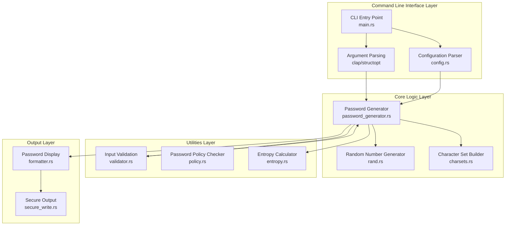
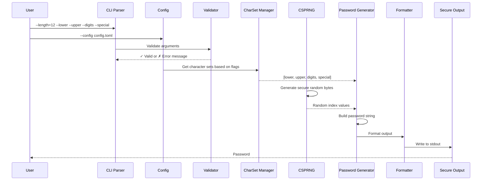
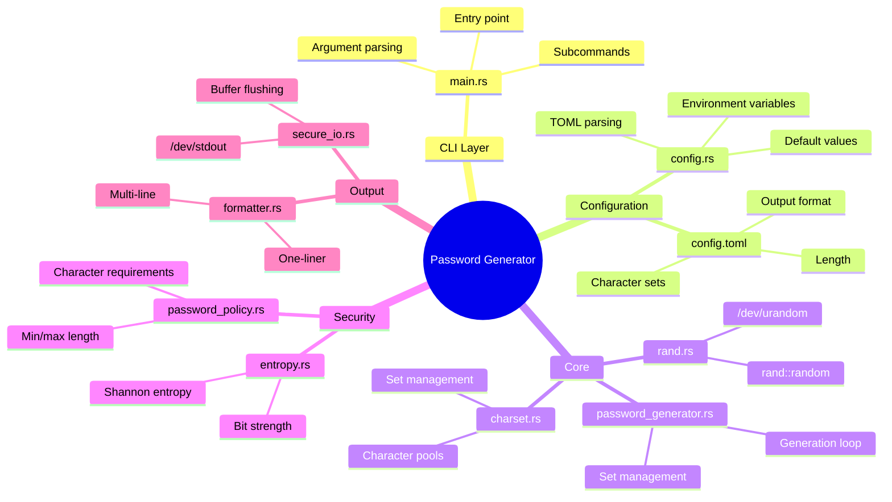
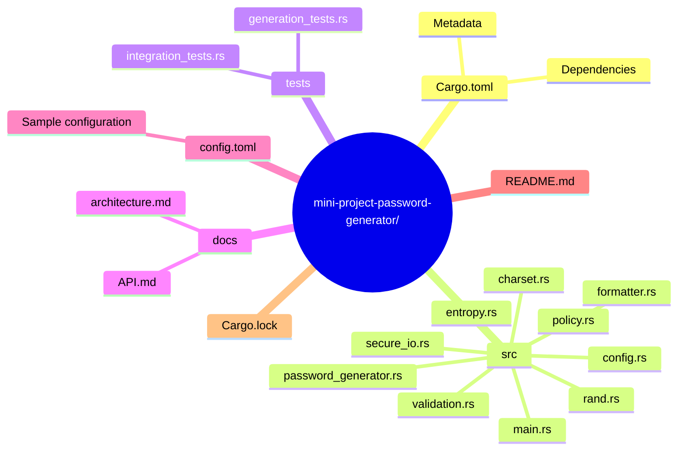
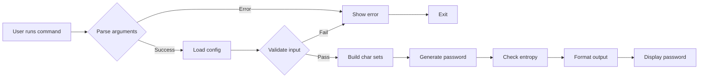
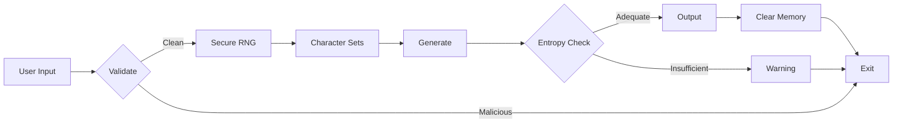

# Rust CLI Password Generator - Architecture

## High-Level Architecture Diagram



## Detailed Module Architecture

```mermaid
graph TB
    subgraph "Entry Point"
        main[main.rs<br/>CLI Entry Point]
    end

    subgraph "Configuration"
        config[config.rs<br/>Configuration Management]
        config2[settings.rs<br/>Default Settings]
        config3[config.toml<br/>User Config File]
    end

    subgraph "Argument Parser"
        clap[clap.rs<br/>Command Line Arguments]
        subcmd[Subcommands<br/>generate/help/version]
    end

    subgraph "Core Components"
        password_gen[password_generator.rs<br/>Main Generation Logic]
        rand[rand.rs<br/>CSPRNG Integration]
        charset[charset.rs<br/>Character Set Management]
    end

    subgraph "Character Types"
        lower[lowercase_chars.rs<br/>a-z]
        upper[uppercase_chars.rs<br/>A-Z]
        digits[digits_chars.rs<br/>0-9]
        special[special_chars.rs<br/>!@#$%^&*]
    end

    subgraph "Security & Validation"
        entropy[entropy.rs<br/>Strength Analysis]
        policy[password_policy.rs<br/>Policy Enforcement]
        validate[input_validation.rs<br/>Input Sanitization]
    end

    subgraph "Output"
        formatter[formatter.rs<br/>Output Formatting]
        secure[secure_io.rs<br/>Secure Output Writing]
    end

    main --> clap
    main --> config
    clap --> subcmd
    config --> config2
    config --> config3
    subcmd --> password_gen
    password_gen --> rand
    password_gen --> charset
    password_gen --> lower
    password_gen --> upper
    password_gen --> digits
    password_gen --> special
    password_gen --> entropy
    password_gen --> policy
    password_gen --> validate
    password_gen --> formatter
    password_gen --> secure
```

## Data Flow Diagram



## Component Dependencies



## File Structure



## Example Command Flow



## Key Technologies Used

| Component | Technology | Purpose |
|-----------|-----------|---------|
| CLI Parsing | `clap` or `structopt` | Command-line argument handling |
| Random Generation | `rand` + `/dev/urandom` | Cryptographically secure RNG |
| Configuration | `toml` | Structured config file |
| Validation | Custom modules | Input validation |
| Output | Direct stdout | Secure display |

## Security Considerations

