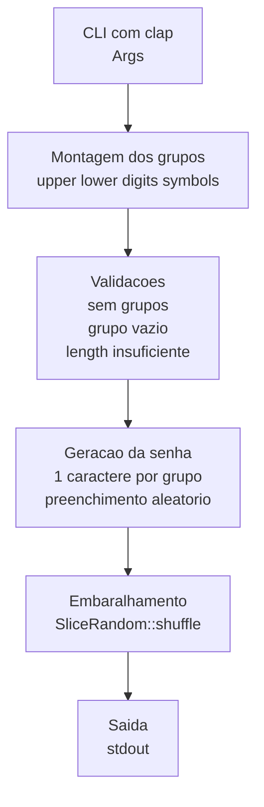
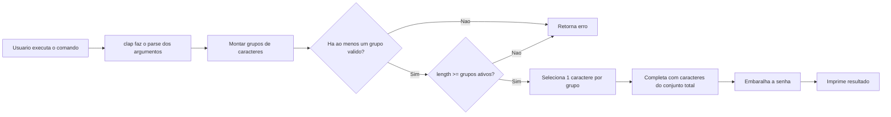
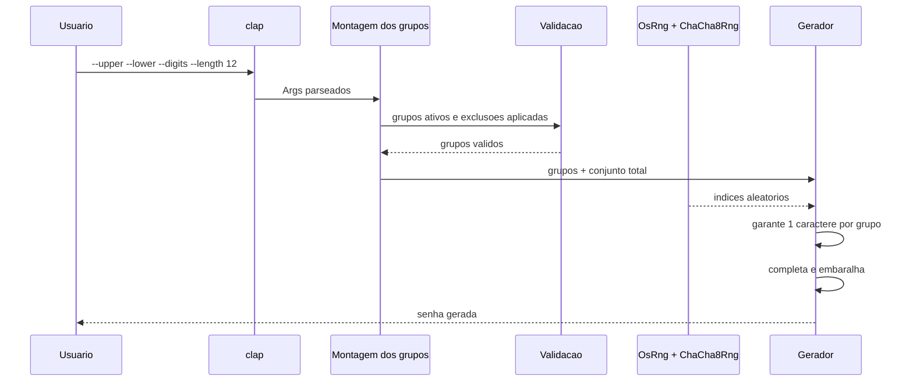

# Implementacao Tecnica

Este documento concentra as informacoes tecnicas da implementacao atual: stack utilizada, organizacao do codigo, fluxo interno de execucao e estrategia de testes.

## Stack de Tecnologias

### Linguagem e runtime

- Rust 2021

### Bibliotecas principais

- `clap`: parsing da interface de linha de comando com derive macros
- `rand`: geracao de numeros aleatorios
- `rand_chacha`: gerador `ChaCha8Rng`
- `getrandom`: integracao com a fonte de entropia do sistema

### Bibliotecas auxiliares presentes no projeto

- `dotenvy`: dependencia declarada, mas atualmente nao usada no codigo

### Dependencias de teste

- `assert_cmd`: execucao do binario em testes de integracao
- `predicates`: validacao de saida e mensagens de erro nos testes
- `tempfile`: dependencia de apoio para testes, embora nao esteja sendo usada hoje

## Estrutura Atual do Projeto

```text
mini-project-password-generator/
├── Cargo.toml
├── Cargo.lock
├── README.md
├── docs/
│   └── implementacao-tecnica.md
├── src/
│   └── main.rs
└── tests/
    └── integration.rs
```

## Organizacao do Codigo

A implementacao atual esta concentrada em um unico binario em `src/main.rs`.

### Responsabilidades principais

1. Definicao da CLI com `clap`
2. Montagem dos grupos de caracteres a partir dos flags ativos
3. Aplicacao de exclusoes especificas via `--exclude`
4. Validacao das pre-condicoes para gerar a senha
5. Geracao da senha garantindo um caractere por requisito selecionado
6. Embaralhamento e escrita do resultado em `stdout`

## Fluxo de Arquitetura

### Diagrama de arquitetura



### Fluxo de execucao



### Fluxo de dados



## Regras Implementadas no Codigo

### Selecao dos grupos

Os grupos sao ativados por flags booleanos:

- `--upper`
- `--lower`
- `--digits`
- `--symbols`

Se nenhum grupo for selecionado, o programa encerra com erro.

### Validacoes

Antes da geracao, o programa valida:

- se existe ao menos um grupo ativo;
- se algum grupo ativo ficou vazio apos as exclusoes;
- se `length` e suficiente para cobrir a quantidade de grupos selecionados.

### Garantia dos requisitos

O algoritmo atual garante os requisitos escolhidos da seguinte forma:

1. seleciona um caractere aleatorio de cada grupo ativo;
2. preenche o restante da senha a partir do conjunto combinado;
3. embaralha o vetor final para evitar previsibilidade de posicao.

## Estrategia de Testes

Os testes de integracao ficam em `tests/integration.rs` e exercitam o binario completo.

### Cobertura atual

- geracao basica de senha;
- respeito ao parametro `--length`;
- respeito ao parametro `--count`;
- ausencia de maiusculas quando grupos correspondentes nao sao selecionados;
- exclusao de caracteres com `--exclude`;
- falha quando nenhum grupo e informado;
- presenca obrigatoria de cada requisito selecionado;
- falha quando `length` e menor que o numero de requisitos ativos;
- falha quando exclusoes tornam um requisito impossivel.

### Comandos uteis

```bash
# Suite completa
cargo test

# Apenas os testes de integracao
cargo test --test integration
```

## Observacoes Tecnicas

- a implementacao atual esta centralizada em um unico arquivo, o que simplifica o projeto pequeno mas limita a separacao de responsabilidades;
- `dotenvy` e `tempfile` estao presentes nas dependencias, mas nao participam do comportamento atual;
- a documentacao de alto nivel fica no README, enquanto detalhes tecnicos e de testes ficam neste arquivo.